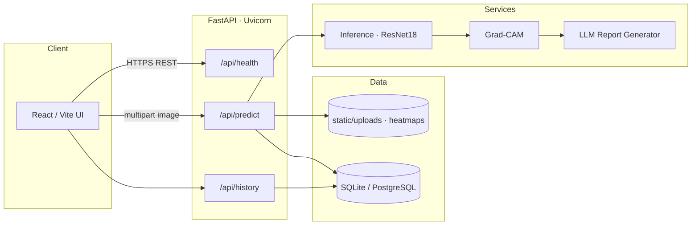

# AI Medical Intelligence Platform

**Deep Learning · Explainable AI (Grad-CAM) · LLM-Assisted Reporting · FastAPI · React · Docker**

End-to-end demo that analyzes a chest X-ray, predicts **Normal vs Pneumonia**, explains the decision with a **Grad-CAM** heatmap, and generates a **plain-language assistive report** via an LLM (or a safe template fallback). Results are exposed through a REST API, stored in a database, and shown in a clinical-style React UI.

> **Not a medical device.** This is an educational / portfolio prototype for technical evaluation. It must not be used for clinical diagnosis or treatment decisions.

| | |
|---|---|
| **Domain** | Medical image analysis (chest X-ray) |
| **Repo layout** | See [PROJECT_SPEC.md](PROJECT_SPEC.md) |
| **License** | [MIT](LICENSE) |

---

## Table of contents

1. [Project overview](#1-project-overview)
2. [Architecture](#2-architecture)
3. [Tech stack](#3-tech-stack)
4. [Repository structure](#4-repository-structure)
5. [Setup — local development](#5-setup--local-development)
6. [Setup — Docker](#6-setup--docker)
7. [Deploy on Render](#7-deploy-on-render)
8. [API documentation](#8-api-documentation)
9. [Training the model](#9-training-the-model)
10. [Screenshots](#10-screenshots)
11. [Testing](#11-testing)
12. [Limitations & disclaimer](#12-limitations--disclaimer)

---

## 1. Project overview

### What it does

1. User uploads a chest X-ray (PNG / JPEG / WebP).
2. Backend runs a **ResNet18** (ImageNet transfer learning) classifier.
3. **Grad-CAM** highlights image regions that most influenced the prediction.
4. An **LLM report generator** (OpenAI or Gemini) writes a short, non-specialist summary — always ending with a medical disclaimer. Without an API key, a template report is used.
5. The full record is saved to **SQLite** (local) or **PostgreSQL** (Docker).
6. The React UI shows prediction, confidence, heatmap, report, and history.

### In scope

- Binary classification: Normal / Pneumonia  
- Grad-CAM overlay PNGs under `static/heatmaps/`  
- LLM or template assistive reports  
- REST API + React dashboard + optional Streamlit UI  
- Docker Compose (API + UI + Postgres)

### Out of scope

- FDA/CE clinical validation  
- DICOM / PACS integration  
- Multi-modal fusion (labs + notes + imaging)

---

## 2. Architecture

### Mermaid



### ASCII

```
      +---------------------------+
      |   CLIENT (React / Vite)   |
      |  Upload X-ray · results   |
      |  Grad-CAM · report · hist |
      +-------------+-------------+
                    |  REST / JSON
                    v
      +---------------------------+
      |   FastAPI  (Uvicorn)      |
      |  /api/predict             |
      |  /api/history             |
      |  /api/health              |
      +------+-------------+------+
             |             |
             v             v
      +-------------+   +------------------+
      | Inference   |   | Persistence      |
      | ResNet18    |   | SQLAlchemy ORM   |
      | Grad-CAM    |   | SQLite/Postgres  |
      +------+------+   +------------------+
             |
             v
      +------------------+
      | LLM reporting    |
      | OpenAI / Gemini  |
      | or template stub |
      +------------------+

  Docker Compose:  frontend ↔ backend ↔ db (Postgres)
  Volumes:         uploads, heatmaps, model_weights
```

### Request flow (`POST /api/predict`)

1. Validate & save upload → `static/uploads/`  
2. Run model → label + confidence  
3. Grad-CAM → `static/heatmaps/`  
4. LLM / template → `report_text`  
5. Insert row into `predictions`  
6. Return JSON: prediction, confidence, heatmap_url, report_text, …

---

## 3. Tech stack

| Layer | Technologies |
|-------|----------------|
| **Deep learning** | PyTorch, torchvision, ResNet18 (ImageNet pretrained) |
| **XAI** | Custom Grad-CAM (`app/models/gradcam.py`) on ResNet `layer4` |
| **LLM** | OpenAI API and/or Google Gemini; template fallback |
| **API** | FastAPI, Uvicorn, Pydantic, python-multipart |
| **Database** | SQLAlchemy 2.x · SQLite (dev) · PostgreSQL 16 (Docker) · Alembic |
| **Frontend** | React 18, Vite, Tailwind CSS, Axios, React Router |
| **Alt UI** | Streamlit (`frontend_streamlit/`) |
| **DevOps** | Docker, Docker Compose, nginx |
| **Quality** | pytest, Black, Ruff |

---

## 4. Repository structure

```
ai-medical-intelligence-platform/
├── backend/                 # FastAPI app
│   ├── app/
│   │   ├── api/             # routes_predict, routes_history, routes_health
│   │   ├── db/              # models, crud, database, schemas
│   │   ├── models/          # ml_model.py, gradcam.py
│   │   ├── llm/             # report_generator.py
│   │   └── services/        # inference, gradcam, llm wrappers
│   ├── model_weights/       # best_model.pth (local / mounted in Docker)
│   ├── static/uploads|heatmaps/
│   ├── tests/
│   ├── Dockerfile
│   └── requirements.txt
├── frontend/                # React + Vite + Tailwind
│   ├── src/pages|components|api|hooks/
│   ├── Dockerfile           # multi-stage → nginx
│   └── nginx.conf
├── frontend_streamlit/      # Optional Streamlit UI
├── model/                   # Training scripts & checkpoints
├── notebooks/               # train_model.ipynb
├── data/                    # Dataset (gitignored) + samples/
├── docs/                    # Architecture notes, PDF report
├── docker-compose.yml
├── .env.example
├── PROJECT_SPEC.md
└── README.md
```

---

## 5. Setup — local development

### Prerequisites

- **Python 3.11+** (3.11 recommended for PyTorch wheels)
- **Node.js 20+** and npm
- Git

### 1. Clone & environment

```bash
git clone https://github.com/<your-org>/ai-medical-intelligence-platform.git
cd ai-medical-intelligence-platform
cp .env.example .env
cp backend/.env.example backend/.env
```

Edit `backend/.env` as needed:

| Variable | Local default | Notes |
|----------|---------------|--------|
| `DATABASE_URL` | `sqlite:///./predictions.db` | Use Postgres URL if desired |
| `MODEL_PATH` | `./model_weights/best_model.pth` | Path to trained weights |
| `LLM_PROVIDER` | `stub` | `openai` · `gemini` · `stub` |
| `LLM_API_KEY` | empty | Required for live LLM calls |
| `CORS_ORIGINS` | `http://localhost:5173,...` | Comma-separated |

### 2. Model weights

Place a checkpoint at:

```text
backend/model_weights/best_model.pth
```

Or train one (see [Training](#9-training-the-model)).

### 3. Backend

```bash
cd backend
python -m venv .venv

# Windows
.venv\Scripts\activate

# macOS / Linux
source .venv/bin/activate

pip install -r requirements.txt
uvicorn app.main:app --reload --host 127.0.0.1 --port 8000
```

- Swagger UI: http://127.0.0.1:8000/docs  
- Health: http://127.0.0.1:8000/api/health  

### 4. Frontend

```bash
cd frontend
npm install
npm run dev
```

Open http://127.0.0.1:5173 — Vite proxies `/api` and `/static` to the backend.

### 5. Streamlit (optional)

```bash
cd frontend_streamlit
pip install -r requirements.txt
set API_BASE=http://127.0.0.1:8000   # Windows
# export API_BASE=http://127.0.0.1:8000  # macOS/Linux
streamlit run app.py
```

---

## 6. Setup — Docker

### Prerequisites

- Docker Desktop (or Docker Engine + Compose v2)

### Run the stack

```bash
cp .env.example .env
# Ensure backend/model_weights/best_model.pth exists
docker compose up --build
```

| Service | URL / port |
|---------|------------|
| **UI (nginx)** | http://localhost:3000 |
| **API** | http://localhost:8000/docs |
| **Health** | http://localhost:8000/api/health |
| **Postgres** | `localhost:5432` — db `medai`, user `medai_user` |

Compose networking:

- `frontend` → proxies `/api` & `/static` to `backend:8000`
- `backend` → `DATABASE_URL=postgresql://…@db:5432/medai`
- Volumes: `./backend/static`, `./backend/model_weights` (ro), Postgres `pgdata`

Stop:

```bash
docker compose down
```

---

## 7. Deploy on Render

This repo includes a Render Blueprint at [`render.yaml`](render.yaml) that provisions:

| Resource | Name | Notes |
|----------|------|--------|
| PostgreSQL | `medai-db` | Free plan; `DATABASE_URL` injected into the API |
| Web (Docker) | `medai-backend` | FastAPI via `backend/Dockerfile` + `start.sh` (`$PORT`) |
| Static site | `medai-frontend` | `npm run build` → publish `frontend/dist` |

### One-click / Blueprint

1. Push this repository to GitHub.
2. In [Render Dashboard](https://dashboard.render.com) → **New** → **Blueprint**.
3. Select the repo containing `render.yaml`.
4. Fill **secret** env vars when prompted (see below), then apply.

### Environment variables

#### Backend (`medai-backend`)

| Key | Required | Description |
|-----|----------|-------------|
| `DATABASE_URL` | auto | From Render Postgres (`fromDatabase` in `render.yaml`). `postgres://` is normalized to `postgresql://` in app config. |
| `LLM_API_KEY` | optional | OpenAI or Gemini secret. Leave empty and keep `LLM_PROVIDER=stub` for template reports. |
| `LLM_PROVIDER` | optional | `stub` (default) · `openai` · `gemini` |
| `LLM_MODEL` | optional | e.g. `gpt-4o-mini` or `gemini-1.5-flash` |
| `CORS_ORIGINS` | **yes** | Frontend origin, e.g. `https://medai-frontend.onrender.com` |
| `MODEL_PATH` | auto | `/app/model_weights/best_model.pth` |
| `MODEL_URL` | recommended | Public HTTPS URL to `best_model.pth` if weights are not in the Docker image (they are gitignored by default). |

#### Frontend (`medai-frontend`)

| Key | Required | Description |
|-----|----------|-------------|
| `VITE_API_BASE_URL` | **yes** | Backend public origin, e.g. `https://medai-backend.onrender.com` (no trailing slash). Baked in at **build** time. |

### Deploy order (recommended)

1. Apply Blueprint and wait for **Postgres** + **backend** to become healthy (`/api/health`).
2. Set `CORS_ORIGINS` on the backend to the frontend URL (or `*` only for demos — not recommended).
3. Set `VITE_API_BASE_URL` on the frontend to the backend URL.
4. Set `MODEL_URL` (or bake weights into the image) and **Clear build cache & deploy** the backend if needed.
5. Redeploy the frontend so Vite picks up `VITE_API_BASE_URL`.

Manual service settings (without Blueprint): see [docs/RENDER.md](docs/RENDER.md).

### Model weights on Render

Checkpoints are typically **not** in Git (see `.gitignore`). Options:

1. Host `best_model.pth` on a private/public object URL and set `MODEL_URL` (downloaded on container start).
2. Use Git LFS and ensure Render’s Docker build receives the file under `backend/model_weights/`.
3. Build the image locally with weights present and push to a registry (advanced).

### Free-tier notes

- Cold starts can take 30–60+ seconds (PyTorch image is large).
- Ephemeral filesystem: uploads/heatmaps may be lost on restart unless you attach a Render Disk to `/app/static`.
- Keep `LLM_PROVIDER=stub` if you do not want to spend API credits.

### Post-deploy checklist

- [ ] `GET https://<backend>/api/health` → `{"status":"ok",...}`
- [ ] Frontend loads and can call predict without CORS errors
- [ ] Heatmap images load from `https://<backend>/static/heatmaps/...`
- [ ] Live demo URL added at the bottom of this README

---

## 8. API documentation

Interactive OpenAPI docs are served at **`/docs`** (Swagger) and **`/redoc`**.

### Endpoints

| Method | Path | Description |
|--------|------|-------------|
| `GET` | `/api/health` | Liveness + whether model weights loaded |
| `POST` | `/api/predict` | Upload X-ray → prediction, heatmap, report, DB write |
| `GET` | `/api/history` | Paginated history (`page`, `page_size`) |

### `POST /api/predict`

**Request:** `multipart/form-data` with field `file` (image).

**Response `200` (shape):**

```json
{
  "id": 1,
  "prediction": "Pneumonia",
  "confidence": 0.9421,
  "heatmap_url": "/static/heatmaps/<id>_heatmap.png",
  "image_url": "/static/uploads/<id>.png",
  "report_text": "…plain-language summary…\n\nDisclaimer: This is not a medical diagnosis…",
  "created_at": "2026-07-22T10:15:32.000000"
}
```

**Errors:** `400` invalid file · `422` validation · `500` pipeline failure.

### `GET /api/history`

```http
GET /api/history?page=1&page_size=20
```

```json
{
  "items": [ /* HistoryItem[] — same fields as predict */ ],
  "total": 42,
  "page": 1,
  "page_size": 20
}
```

### `GET /api/health`

```json
{
  "status": "ok",
  "model_loaded": true,
  "model_version": "resnet18-v1.0"
}
```

### Database table `predictions`

| Column | Type | Description |
|--------|------|-------------|
| `id` | Integer PK | Auto-increment |
| `image_path` | String | Stored upload filename/path |
| `heatmap_path` | String | Grad-CAM filename/path |
| `prediction_label` | String | e.g. `Normal` / `Pneumonia` |
| `confidence` | Float | Softmax score 0–1 |
| `report_text` | Text | LLM / template report |
| `created_at` | Timestamp | Server time (indexed) |

---

## 9. Training the model

Use the notebook or CLI scripts:

```bash
# Notebook
# open notebooks/train_model.ipynb

# Or demo data + CLI (from model/)
cd model
pip install -r requirements.txt
python prepare_demo_data.py
python train.py --data-dir ../data --epochs 5 --batch-size 8
# Copy checkpoint → backend/model_weights/best_model.pth
```

For real performance, replace synthetic `data/` samples with a full Chest X-Ray Pneumonia dataset and retrain.

---

## 10. Screenshots

> Add real captures under `docs/screenshots/` and replace the placeholders below.

### Analysis / upload page


_Placeholder: drag-and-drop upload, prediction label, confidence bar, Grad-CAM pair, LLM report._

### History page


_Placeholder: paginated table of past predictions from `GET /api/history`._

### API docs


_Placeholder: FastAPI Swagger at `/docs`._

---

## 11. Testing

```bash
cd backend
python -m venv .venv
# activate venv
pip install -r requirements.txt

# Prefer a dedicated SQLite file for tests
set DATABASE_URL=sqlite:///./predictions_test.db
set LLM_PROVIDER=stub

pytest -q
```

Core coverage:

- `tests/test_health.py` — `/api/health` returns 200  
- `tests/test_predict.py` — `/api/predict` response shape with sample image  
- `tests/test_crud.py` — DB insert / read via `crud.py`  
- Grad-CAM + history smoke tests  

---

## 12. Limitations & disclaimer

### Limitations

- Trained / demo data may be synthetic or small; metrics are **not** clinical-grade.
- Binary labels only (Normal / Pneumonia); no COVID multi-class in default config.
- Grad-CAM explains model attention — not ground-truth pathology localization.
- LLM text can hallucinate if a live API is used; temperature is kept low and a disclaimer is forced.
- No authentication; demo mode stores anonymous predictions.
- JPEG/PNG/WebP only — no DICOM pipeline in this version.

### Medical / legal disclaimer

This software is a **technical demonstration** built for education and hiring evaluation. It is **not** a certified medical device and **must not** be used for diagnosis, triage, or treatment.

All AI outputs (class labels, heatmaps, and narrative reports) require review by a **licensed physician or radiologist**. By using this project you agree that the authors and affiliates accept no liability for clinical decisions made using these materials.

Every generated report is designed to end with language equivalent to:

> *This is not a medical diagnosis. A qualified doctor must confirm any finding.*

---

## License

MIT — see [LICENSE](LICENSE).

## Acknowledgments

- PyTorch / torchvision ResNet18 ImageNet weights  
- FastAPI, SQLAlchemy, React, Tailwind CSS, and the open medical imaging research community  

---

**Live demo:** _add your deployment URL here after hosting (Render / Railway / HF Spaces / EC2)._
