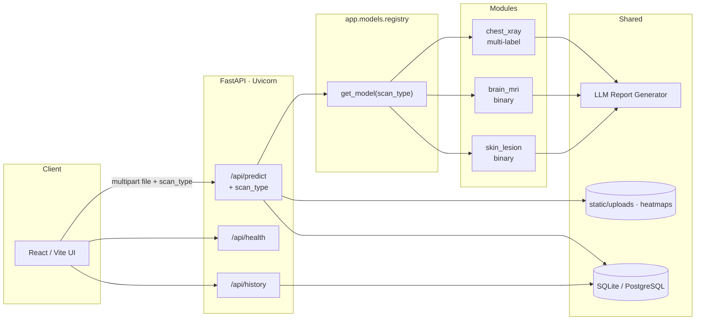

# AI Medical Intelligence Platform

**Deep Learning · Explainable AI (Grad-CAM) · LLM-Assisted Reporting · FastAPI · React · Docker**

End-to-end multi-disease imaging demo. The user selects a **scan type**, uploads an image, and the backend routes to the matching module via a **model registry**. Each module runs inference + **Grad-CAM**, then an **LLM** (or template) writes a plain-language assistive report. Results are stored in a database and shown in a React UI.

| Module | `scan_type` | Task | Labels |
|--------|-------------|------|--------|
| Chest X-ray | `chest_xray` | **Multi-label** | Normal, Pneumonia, COVID-19, Tuberculosis |
| Brain MRI | `brain_mri` | **Binary** | Tumor, No Tumor |
| Skin lesion *(stretch)* | `skin_lesion` | **Binary** | Malignant, Benign |

> **Not a medical device.** This is an educational / portfolio prototype for technical evaluation. It must not be used for clinical diagnosis or treatment decisions.

| | |
|---|---|
| **Domain** | Multi-disease medical image analysis |
| **Repo layout** | See [PROJECT_SPEC.md](PROJECT_SPEC.md) |
| **License** | [MIT](LICENSE) |

---

## Table of contents

1. [Project overview](#1-project-overview)
2. [Architecture](#2-architecture)
3. [Tech stack](#3-tech-stack)
4. [Repository structure](#4-repository-structure)
5. [Setup — local development](#5-setup--local-development)
6. [Setup — Docker](#6-setup--docker)
7. [Deploy on Render](#7-deploy-on-render)
8. [API documentation](#8-api-documentation)
9. [Training the model](#9-training-the-model)
10. [Screenshots](#10-screenshots)
11. [Testing](#11-testing)
12. [Limitations & disclaimer](#12-limitations--disclaimer)

---

## 1. Project overview

### What it does

1. User picks a **scan type** (Chest X-ray / Brain MRI / Skin Lesion) and uploads an image (PNG / JPEG / WebP).
2. Backend validates `scan_type` and loads the module through **`registry.get_model(scan_type)`**.
3. The module’s CNN runs inference; **Grad-CAM** uses that module’s target layer.
4. An **LLM report generator** addresses one or many conditions (ranked by confidence) and always appends a physician-confirmation disclaimer. Without an API key, a template report is used.
5. The record is saved with `scan_type` and a JSON list of `{label, confidence}` in **SQLite** (local) or **PostgreSQL** (Docker).
6. The React UI shows scan type, single- or multi-condition results, heatmap, report, and history.

### In scope

- Multi-label chest X-ray + binary brain MRI (+ optional skin lesion)  
- Per-module weights under `backend/model_weights/<scan_type>/`  
- Per-module Grad-CAM overlays under `static/heatmaps/`  
- LLM or template assistive reports for multi-condition lists  
- REST API + React dashboard + optional Streamlit UI  
- Docker Compose (API + UI + Postgres)

### Out of scope

- FDA/CE clinical validation  
- DICOM / PACS integration  
- Multi-modal fusion (labs + notes + imaging)

---

## 2. Architecture

### High-level design

Three **independent** disease modules share one FastAPI surface. The frontend always sends `scan_type` with the upload. A central **registry** maps that string to the correct model package and Grad-CAM implementation.

```text
scan_type ──► app.models.registry.get_model(scan_type)
                    │
        ┌───────────┼───────────┐
        ▼           ▼           ▼
  chest_xray   brain_mri   skin_lesion
  (multi-label) (binary)    (binary)
  model.py      model.py    model.py
  gradcam.py    gradcam.py  gradcam.py
        │           │           │
        └───────────┼───────────┘
                    ▼
         LLM report (list of conditions)
                    ▼
         DB: scan_type + prediction_label JSON
```

| Concern | Chest X-ray | Brain MRI / Skin lesion |
|---------|-------------|-------------------------|
| Output head | Multi-label logits + sigmoid | Softmax over 2 classes |
| API `predictions` | **List** of all classes with confidence ≥ **0.5** | **List of length 1** `{label, confidence}` |
| Grad-CAM class | Highest sigmoid probability | Predicted class (argmax) |
| Weights path | `model_weights/chest_xray/best_model.pth` | `model_weights/brain_mri/` or `…/skin_lesion/` |

### Mermaid



### ASCII

```
      +----------------------------------+
      |   CLIENT (React / Vite)          |
      |  Scan-type selector · upload     |
      |  Multi/single results · history  |
      +----------------+-----------------+
                       |  REST / JSON
                       v
      +----------------------------------+
      |   FastAPI  (Uvicorn)             |
      |  POST /api/predict               |
      |    form: file + scan_type        |
      |  GET  /api/history [?scan_type]  |
      |  GET  /api/health                |
      +---------+------------------------+
                |
                v
      +----------------------------------+
      |  registry.get_model(scan_type)   |
      +----+----------+----------+-------+
           |          |          |
           v          v          v
      chest_xray  brain_mri  skin_lesion
      Grad-CAM    Grad-CAM   Grad-CAM
           |          |          |
           +-----+----+-----+----+
                 v
           LLM / template report
                 v
           predictions table
           (scan_type + JSON labels)
```

### Request flow (`POST /api/predict`)

1. Validate `scan_type` (`chest_xray` \| `brain_mri` \| `skin_lesion`) — **400** if unknown; **422** if missing.  
2. Validate & save upload → `static/uploads/`.  
3. `module = get_model(scan_type)` → `module.predict(...)`.  
4. Shape `predictions`: multi-label threshold list **or** single binary entry.  
5. Module Grad-CAM → `static/heatmaps/`.  
6. LLM / template report over the condition list.  
7. Insert row (`scan_type`, JSON `prediction_label`, primary `confidence`, …).  
8. Return JSON including `scan_type`, `predictions`, `prediction_label`, URLs, report.

---

## 3. Tech stack

| Layer | Technologies |
|-------|----------------|
| **Deep learning** | PyTorch, torchvision, ResNet18 per module (ImageNet transfer) |
| **XAI** | Per-module Grad-CAM (`app/models/<scan_type>/gradcam.py`) on ResNet `layer4` |
| **Routing** | `app.models.registry.get_model(scan_type)` |
| **LLM** | OpenAI API and/or Google Gemini; multi-condition template fallback |
| **API** | FastAPI, Uvicorn, Pydantic, python-multipart |
| **Database** | SQLAlchemy 2.x · SQLite (dev) · PostgreSQL 16 (Docker) · Alembic |
| **Frontend** | React 18, Vite, Tailwind CSS, Axios, React Router |
| **Alt UI** | Streamlit (`frontend_streamlit/`) |
| **DevOps** | Docker, Docker Compose, nginx |
| **Quality** | pytest, Black, Ruff |

---

## 4. Repository structure

```
ai-medical-intelligence-platform/
├── backend/                 # FastAPI app
│   ├── app/
│   │   ├── api/             # routes_predict, routes_history, routes_health
│   │   ├── db/              # models, crud, database, schemas
│   │   ├── models/          # registry.py + chest_xray|brain_mri|skin_lesion/
│   │   ├── llm/             # report_generator.py (multi-condition prompts)
│   │   └── services/        # inference, gradcam, llm wrappers
│   ├── model_weights/       # chest_xray/ · brain_mri/ · skin_lesion/
│   ├── static/uploads|heatmaps/
│   ├── alembic/             # 0002_scan_type_json_labels, …
│   ├── tests/
│   ├── Dockerfile
│   └── requirements.txt
├── frontend/                # React + Vite + Tailwind
│   ├── src/pages|components|api|hooks/
│   ├── Dockerfile           # multi-stage → nginx
│   └── nginx.conf
├── frontend_streamlit/      # Optional Streamlit UI
├── models/                  # Per-module training helpers (optional)
├── notebooks/               # train_chest_xray.ipynb, train_brain_mri.ipynb
├── data/                    # Dataset (gitignored) + samples/
├── docs/                    # Architecture notes, PDF report
├── docker-compose.yml
├── .env.example
├── PROJECT_SPEC.md
└── README.md
```

---

## 5. Setup — local development

### Prerequisites

- **Python 3.11+** (3.11 recommended for PyTorch wheels)
- **Node.js 20+** and npm
- Git

### 1. Clone & environment

```bash
git clone https://github.com/<your-org>/ai-medical-intelligence-platform.git
cd ai-medical-intelligence-platform
cp .env.example .env
cp backend/.env.example backend/.env
```

Edit `backend/.env` as needed:

| Variable | Local default | Notes |
|----------|---------------|--------|
| `DATABASE_URL` | `sqlite:///./predictions.db` | Use Postgres URL if desired |
| `MODEL_PATH` | `./model_weights/best_model.pth` | Path to trained weights |
| `LLM_PROVIDER` | `stub` | `openai` · `gemini` · `stub` |
| `LLM_API_KEY` | empty | Required for live LLM calls |
| `CORS_ORIGINS` | `http://localhost:5173,...` | Comma-separated |

### 2. Model weights

Place a checkpoint at:

```text
backend/model_weights/best_model.pth
```

Or train one (see [Training](#9-training-the-model)).

### 3. Backend

```bash
cd backend
python -m venv .venv

# Windows
.venv\Scripts\activate

# macOS / Linux
source .venv/bin/activate

pip install -r requirements.txt
uvicorn app.main:app --reload --host 127.0.0.1 --port 8000
```

- Swagger UI: http://127.0.0.1:8000/docs  
- Health: http://127.0.0.1:8000/api/health  

### 4. Frontend

```bash
cd frontend
npm install
npm run dev
```

Open http://127.0.0.1:5173 — Vite proxies `/api` and `/static` to the backend.

### 5. Streamlit (optional)

```bash
cd frontend_streamlit
pip install -r requirements.txt
set API_BASE=http://127.0.0.1:8000   # Windows
# export API_BASE=http://127.0.0.1:8000  # macOS/Linux
streamlit run app.py
```

---

## 6. Setup — Docker

### Prerequisites

- Docker Desktop (or Docker Engine + Compose v2)

### Run the stack

```bash
cp .env.example .env
# Ensure backend/model_weights/best_model.pth exists
docker compose up --build
```

| Service | URL / port |
|---------|------------|
| **UI (nginx)** | http://localhost:3000 |
| **API** | http://localhost:8000/docs |
| **Health** | http://localhost:8000/api/health |
| **Postgres** | `localhost:5432` — db `medai`, user `medai_user` |

Compose networking:

- `frontend` → proxies `/api` & `/static` to `backend:8000`
- `backend` → `DATABASE_URL=postgresql://…@db:5432/medai`
- Volumes: `./backend/static`, `./backend/model_weights` (ro), Postgres `pgdata`

Stop:

```bash
docker compose down
```

---

## 7. Deploy on Render

This repo includes a Render Blueprint at [`render.yaml`](render.yaml) that provisions:

| Resource | Name | Notes |
|----------|------|--------|
| PostgreSQL | `medai-db` | Free plan; `DATABASE_URL` injected into the API |
| Web (Docker) | `medai-backend` | FastAPI via `backend/Dockerfile` + `start.sh` (`$PORT`) |
| Static site | `medai-frontend` | `npm run build` → publish `frontend/dist` |

### One-click / Blueprint

1. Push this repository to GitHub.
2. In [Render Dashboard](https://dashboard.render.com) → **New** → **Blueprint**.
3. Select the repo containing `render.yaml`.
4. Fill **secret** env vars when prompted (see below), then apply.

### Environment variables

#### Backend (`medai-backend`)

| Key | Required | Description |
|-----|----------|-------------|
| `DATABASE_URL` | auto | From Render Postgres (`fromDatabase` in `render.yaml`). `postgres://` is normalized to `postgresql://` in app config. |
| `LLM_API_KEY` | optional | OpenAI or Gemini secret. Leave empty and keep `LLM_PROVIDER=stub` for template reports. |
| `LLM_PROVIDER` | optional | `stub` (default) · `openai` · `gemini` |
| `LLM_MODEL` | optional | e.g. `gpt-4o-mini` or `gemini-1.5-flash` |
| `CORS_ORIGINS` | **yes** | Frontend origin, e.g. `https://medai-frontend.onrender.com` |
| `MODEL_PATH` | auto | `/app/model_weights/best_model.pth` |
| `MODEL_URL` | recommended | Public HTTPS URL to `best_model.pth` if weights are not in the Docker image (they are gitignored by default). |

#### Frontend (`medai-frontend`)

| Key | Required | Description |
|-----|----------|-------------|
| `VITE_API_BASE_URL` | **yes** | Backend public origin, e.g. `https://medai-backend.onrender.com` (no trailing slash). Baked in at **build** time. |

### Deploy order (recommended)

1. Apply Blueprint and wait for **Postgres** + **backend** to become healthy (`/api/health`).
2. Set `CORS_ORIGINS` on the backend to the frontend URL (or `*` only for demos — not recommended).
3. Set `VITE_API_BASE_URL` on the frontend to the backend URL.
4. Set `MODEL_URL` (or bake weights into the image) and **Clear build cache & deploy** the backend if needed.
5. Redeploy the frontend so Vite picks up `VITE_API_BASE_URL`.

Manual service settings (without Blueprint): see [docs/RENDER.md](docs/RENDER.md).

### Model weights on Render

Checkpoints are typically **not** in Git (see `.gitignore`). Options:

1. Host `best_model.pth` on a private/public object URL and set `MODEL_URL` (downloaded on container start).
2. Use Git LFS and ensure Render’s Docker build receives the file under `backend/model_weights/`.
3. Build the image locally with weights present and push to a registry (advanced).

### Free-tier notes

- Cold starts can take 30–60+ seconds (PyTorch image is large).
- Ephemeral filesystem: uploads/heatmaps may be lost on restart unless you attach a Render Disk to `/app/static`.
- Keep `LLM_PROVIDER=stub` if you do not want to spend API credits.

### Post-deploy checklist

- [ ] `GET https://<backend>/api/health` → `{"status":"ok",...}`
- [ ] Frontend loads and can call predict without CORS errors
- [ ] Heatmap images load from `https://<backend>/static/heatmaps/...`
- [ ] Live demo URL added at the bottom of this README

---

## 8. API documentation

Interactive OpenAPI docs are served at **`/docs`** (Swagger) and **`/redoc`**.

### Endpoints

| Method | Path | Description |
|--------|------|-------------|
| `GET` | `/api/health` | Liveness + per-module `models_loaded` status |
| `POST` | `/api/predict` | Upload image + **`scan_type`** → prediction(s), heatmap, report, DB write |
| `GET` | `/api/history` | Paginated history (`page`, `page_size`, optional `scan_type`) |

### Response shape notes

Every successful `POST /api/predict` returns:

| Field | Meaning |
|-------|---------|
| `scan_type` | Module that ran (`chest_xray` \| `brain_mri` \| `skin_lesion`) |
| `predictions` | Parsed list of `{ "label", "confidence" }` |
| `prediction_label` | Same list, **JSON-serialized** (as stored in the DB) |
| `prediction` | Primary / highest-confidence label (UI convenience) |
| `confidence` | Primary confidence (0–1) |

**Multi-label vs single-label**

| `scan_type` | `predictions` format |
|-------------|----------------------|
| `chest_xray` | **Zero or more** conditions with confidence ≥ **0.5** (ranked highest first). May include several co-occurring findings. |
| `brain_mri` | **Exactly one** `{label, confidence}` — `Tumor` or `No Tumor`. |
| `skin_lesion` | **Exactly one** `{label, confidence}` — `Malignant` or `Benign`. |

**Errors on predict:** `400` invalid file / unknown `scan_type` · `422` missing required `scan_type` (or other validation) · `500` pipeline failure.

---

### `POST /api/predict`

**Request:** `multipart/form-data`

| Field | Required | Description |
|-------|----------|-------------|
| `file` | yes | Image (JPEG / PNG / WebP) |
| `scan_type` | yes | `chest_xray` \| `brain_mri` \| `skin_lesion` |

---

#### Example — Chest X-ray (multi-label)

```bash
curl -X POST "http://127.0.0.1:8000/api/predict" \
  -F "scan_type=chest_xray" \
  -F "file=@/path/to/chest.png"
```

**Response `200`:**

```json
{
  "id": 12,
  "scan_type": "chest_xray",
  "prediction": "Pneumonia",
  "prediction_label": "[{\"label\":\"Pneumonia\",\"confidence\":0.91},{\"label\":\"COVID-19\",\"confidence\":0.67}]",
  "predictions": [
    { "label": "Pneumonia", "confidence": 0.91 },
    { "label": "COVID-19", "confidence": 0.67 }
  ],
  "confidence": 0.91,
  "heatmap_url": "/static/heatmaps/abc123_heatmap.png",
  "image_url": "/static/uploads/abc123.png",
  "report_text": "AI chest X-ray summary\n\nThe automated reading flagged more than one possible finding…\n\nDisclaimer: This is not a medical diagnosis. … A licensed physician …",
  "created_at": "2026-07-23T10:15:32.000000Z"
}
```

Only labels with confidence ≥ 0.5 appear in `predictions`. Classes below threshold (e.g. Tuberculosis at 0.22) are omitted.

---

#### Example — Brain MRI (single-label)

```bash
curl -X POST "http://127.0.0.1:8000/api/predict" \
  -F "scan_type=brain_mri" \
  -F "file=@/path/to/brain_mri.png"
```

**Response `200`:**

```json
{
  "id": 13,
  "scan_type": "brain_mri",
  "prediction": "Tumor",
  "prediction_label": "[{\"label\":\"Tumor\",\"confidence\":0.87}]",
  "predictions": [
    { "label": "Tumor", "confidence": 0.87 }
  ],
  "confidence": 0.87,
  "heatmap_url": "/static/heatmaps/def456_heatmap.png",
  "image_url": "/static/uploads/def456.png",
  "report_text": "AI brain MRI summary\n\nThe automated reading suggests a finding of \"Tumor\"…\n\nDisclaimer: This is not a medical diagnosis. … A licensed physician …",
  "created_at": "2026-07-23T10:16:01.000000Z"
}
```

---

#### Example — Skin lesion (single-label)

```bash
curl -X POST "http://127.0.0.1:8000/api/predict" \
  -F "scan_type=skin_lesion" \
  -F "file=@/path/to/lesion.jpg"
```

**Response `200`:**

```json
{
  "id": 14,
  "scan_type": "skin_lesion",
  "prediction": "Benign",
  "prediction_label": "[{\"label\":\"Benign\",\"confidence\":0.74}]",
  "predictions": [
    { "label": "Benign", "confidence": 0.74 }
  ],
  "confidence": 0.74,
  "heatmap_url": "/static/heatmaps/ghi789_heatmap.png",
  "image_url": "/static/uploads/ghi789.jpg",
  "report_text": "AI skin lesion summary\n\nThe automated reading leans toward \"Benign\"…\n\nDisclaimer: This is not a medical diagnosis. … A licensed physician …",
  "created_at": "2026-07-23T10:16:40.000000Z"
}
```

---

#### Example — invalid / missing `scan_type`

```bash
# Unknown value → 400
curl -X POST "http://127.0.0.1:8000/api/predict" \
  -F "scan_type=hand_xray" \
  -F "file=@/path/to/img.png"

# Missing field → 422
curl -X POST "http://127.0.0.1:8000/api/predict" \
  -F "file=@/path/to/img.png"
```

---

### `GET /api/history`

```http
GET /api/history?page=1&page_size=20
GET /api/history?page=1&page_size=20&scan_type=brain_mri
```

```json
{
  "items": [
    {
      "id": 13,
      "scan_type": "brain_mri",
      "prediction": "Tumor",
      "prediction_label": "[{\"label\":\"Tumor\",\"confidence\":0.87}]",
      "predictions": [{ "label": "Tumor", "confidence": 0.87 }],
      "confidence": 0.87,
      "heatmap_url": "/static/heatmaps/def456_heatmap.png",
      "image_url": "/static/uploads/def456.png",
      "report_text": "…",
      "created_at": "2026-07-23T10:16:01.000000Z"
    }
  ],
  "total": 42,
  "page": 1,
  "page_size": 20
}
```

### `GET /api/health`

```json
{
  "status": "ok",
  "model_loaded": true,
  "models_loaded": {
    "chest_xray": true,
    "brain_mri": false,
    "skin_lesion": false
  },
  "model_version": "resnet18-v1.0"
}
```

### Database table `predictions`

| Column | Type | Description |
|--------|------|-------------|
| `id` | Integer PK | Auto-increment |
| `scan_type` | String(32), indexed | `chest_xray` \| `brain_mri` \| `skin_lesion` |
| `image_path` | String | Stored upload filename/path |
| `heatmap_path` | String | Grad-CAM filename/path |
| `prediction_label` | Text | **JSON list** of `{label, confidence}` (multi- or single-label) |
| `confidence` | Float | Primary / max confidence 0–1 |
| `report_text` | Text | LLM / template report |
| `created_at` | Timestamp | Server time (indexed) |

Alembic migration: `backend/alembic/versions/0002_scan_type_json_labels.py`.

---

## 9. Training the model

Use the notebook or CLI scripts:

```bash
# Notebook
# open notebooks/train_model.ipynb

# Or demo data + CLI (from model/)
cd model
pip install -r requirements.txt
python prepare_demo_data.py
python train.py --data-dir ../data --epochs 5 --batch-size 8
# Copy checkpoint → backend/model_weights/best_model.pth
```

For real performance, replace synthetic `data/` samples with a full Chest X-Ray Pneumonia dataset and retrain.

---

## 10. Screenshots

> Add real captures under `docs/screenshots/` and replace the placeholders below.

### Analysis / upload page


_Placeholder: drag-and-drop upload, prediction label, confidence bar, Grad-CAM pair, LLM report._

### History page


_Placeholder: paginated table of past predictions from `GET /api/history`._

### API docs


_Placeholder: FastAPI Swagger at `/docs`._

---

## 11. Testing

```bash
cd backend
python -m venv .venv
# activate venv
pip install -r requirements.txt

# Prefer a dedicated SQLite file for tests
set DATABASE_URL=sqlite:///./predictions_test.db
set LLM_PROVIDER=stub

pytest -q
```

Core coverage:

- `tests/test_health.py` — `/api/health` returns 200  
- `tests/test_predict.py` — `/api/predict` response shape with sample image  
- `tests/test_crud.py` — DB insert / read via `crud.py`  
- Grad-CAM + history smoke tests  

---

## 12. Limitations & disclaimer

### Limitations

- Trained / demo data may be synthetic or small; metrics are **not** clinical-grade.
- Binary labels only (Normal / Pneumonia); no COVID multi-class in default config.
- Grad-CAM explains model attention — not ground-truth pathology localization.
- LLM text can hallucinate if a live API is used; temperature is kept low and a disclaimer is forced.
- No authentication; demo mode stores anonymous predictions.
- JPEG/PNG/WebP only — no DICOM pipeline in this version.

### Medical / legal disclaimer

This software is a **technical demonstration** built for education and hiring evaluation. It is **not** a certified medical device and **must not** be used for diagnosis, triage, or treatment.

All AI outputs (class labels, heatmaps, and narrative reports) require review by a **licensed physician or radiologist**. By using this project you agree that the authors and affiliates accept no liability for clinical decisions made using these materials.

Every generated report is designed to end with language equivalent to:

> *This is not a medical diagnosis. A qualified doctor must confirm any finding.*

---

## License

MIT — see [LICENSE](LICENSE).

## Acknowledgments

- PyTorch / torchvision ResNet18 ImageNet weights  
- FastAPI, SQLAlchemy, React, Tailwind CSS, and the open medical imaging research community  

---

**Live demo:** _add your deployment URL here after hosting (Render / Railway / HF Spaces / EC2)._
